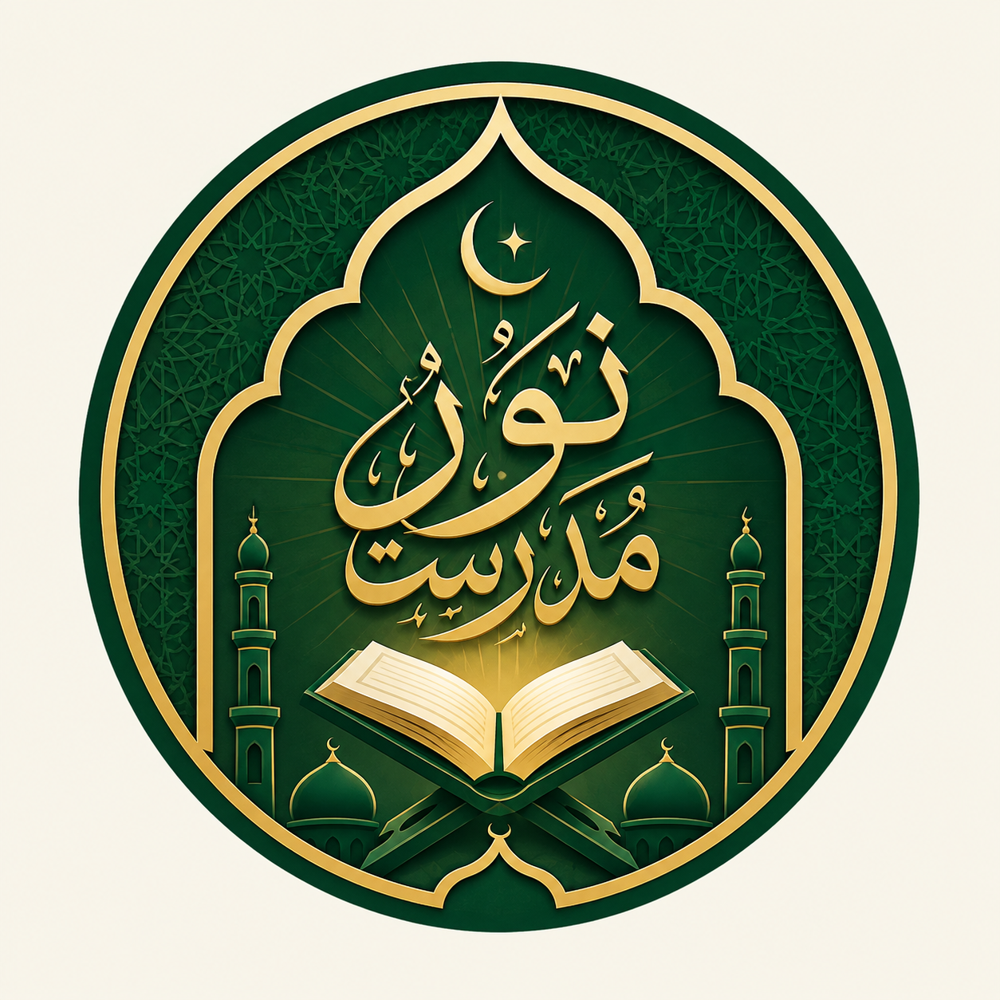

# 📖 Noor Madrassa

  
  <h3>Learn · Reflect · Grow</h3>
  
A modern Islamic learning companion for Madrassa students and general users.

---

<<<<<<< Updated upstream
## Features
=======
##  **About**
>>>>>>> Stashed changes

**Noor Madrassa** is a modern Islamic learning companion designed for Madrassa students and general users. It combines Qur'an reading, Hadith collections, Islamic books, and learning progress tracking in one calm and easy-to-use experience.

<<<<<<< Updated upstream
| Feature | Status | Description |
|---------|--------|-------------|
| Splash Screen |  Done | Brand splash with logo and tagline |
| Onboarding |  Done | 3-slide introduction to app features |
| Home Dashboard |  Done | Personalized learning dashboard |
| Bottom Navigation |  Done | 5-tab navigation (Home, Qur'an, Hadith, Library, Profile) |
| Qur'an Module |  Done | Surah list, reader with Arabic/translation |
| Hadith Module |  Done | Collections, reader with grade/reference |
| Responsive Design |  Done | Adapts to all screen sizes |
| Dark/Light Mode |  Done | Theme toggle support |
| README.md |  Done | Complete project documentation |

### **In Progress / Pending**

| Feature | Status    | Description |
|---------|-----------|-------------|
| Islamic Library |  Pending | Books grid, categories, book reader |
| Madrassa Courses |  Pending | Structured courses with lessons |
| Duas & Azkar |  Pending | Morning/evening duas, prayer duas |
| Audio Player |  Pending | Qur'an audio recitation |
| Search Functionality | Pending   | Global search across all content |
| Bookmarks | Pending   | Save and organize favorite content |
| Profile & Progress | Pending   | User profile, learning progress |
| Quiz/Assessment | Pending   | Lesson quizzes and assessments |
| Certificates/Badges | Pending   | Achievement system |
| Push Notifications | Pending   | Daily reminders and updates |
| Multi-language | Pending   | English, Urdu, Arabic support |
| Offline Support | Pending   | Download content for offline use |
=======
**Core Design Principles:**
-  **Peaceful & Calm** - Interface feels peaceful rather than crowded
-  **Content is Hero** - Typography, spacing, hierarchy matter most
-  **Premium Islamic Identity** - Original visual identity with sophisticated palette
-  **Dark Mode Support** - Complete dark theme for comfortable reading
>>>>>>> Stashed changes

---

## ✨ **Features**

### **Completed Features (v1.0.0)**

| Feature | Status | Description |
|---------|------|-------------|
| **Splash Screen** | Done | Full screen logo with brand tagline |
| **Onboarding** | Done | 3-slide introduction with Skip/Next |
| **Home Dashboard** | Done | Personalized learning dashboard |
| **Bottom Navigation** | Done | 5-tab navigation (Home, Qur'an, Hadith, Library, Profile) |
| **Qur'an Module** | Done | Surah list, reader with Arabic/translation, settings |
| **Hadith Module** | Done | Collections, reader with grade/reference |
| **Library Module** | Done | Islamic books, categories, book reader |
| **Profile Module** | Done | User stats, progress tracking, activity feed |
| **Settings Module** | Done | Theme toggle (Light/Dark/System) |
| **Dark/Light Mode** | Done | Complete dark theme across all screens |
| **Responsive Design** | Done | Adapts to all screen sizes (small to tablet) |
| **Gradient UI** | Done | Unified gradient design across all cards |
| **Version 1.0.0** | Done | Official release version |

### 🚧 **Pending Features (Future Updates)**

| Feature | Priority | Description |
|---------|----------|-------------|
| **Language Support** | 🟡 Medium | English, Urdu, Arabic translation |
| **Audio Player** | 🟡 Medium | Qur'an audio recitation |
| **Search Functionality** | 🟡 Medium | Global search across all content |
| **Bookmarks** | 🟡 Medium | Save and organize favorite content |
| **Madrassa Courses** | 🟢 Low | Structured courses with lessons |
| **Duas & Azkar** | 🟢 Low | Morning/evening duas, prayer duas |
| **Quiz/Assessment** | 🟢 Low | Lesson quizzes and assessments |
| **Certificates/Badges** | 🟢 Low | Achievement system |
| **Push Notifications** | 🟢 Low | Daily reminders and updates |
| **Offline Support** | 🟢 Low | Download content for offline use |

---

##  **Screens Completed**

### 1. Splash Screen
- Full screen brand logo
- Tagline: "Learn · Reflect · Grow"
- 3-second auto-transition

### 2. Onboarding (3 Slides)
- Slide 1: Qur'an & Translation
- Slide 2: Hadith & Islamic Library
- Slide 3: Madrassa Learning
- Skip/Next/Get Started buttons

### 3. Home Dashboard
- Greeting with name and date
- Hero Card: "Continue Your Journey" with progress
- Quick Actions: Qur'an, Hadith, Duas, Courses
- Daily Ayah with translation
- Madrassa Progress with percentage
- Recent items (last 3 opened)

### 4. Bottom Navigation
- Home | Qur'an | Hadith | Library | Profile

### 5. Qur'an Module
- **Qur'an Home**: Surah list with stats, tabs (Surahs/Juz/Bookmarks)
- **Surah Reader**: Arabic text with translation, verse numbers
- **Reader Settings**: Font size control, translation toggle
- **Bookmark**: Save verses/surahs
- **Responsive Arabic font** with Uthmanic style

### 6. Hadith Module
- **Hadith Home**: Featured hadith card, collections grid
- **Collections**: 6 authentic collections (Bukhari, Muslim, Abu Dawud, Tirmidhi, Ibn Majah, Muwatta)
- **Hadith Reader**: Arabic text with translation, chapter name, grade
- **Bookmark**: Save hadiths
- **Grade indicators** (Sahih, Hasan, etc.)

### 7. Islamic Library Module
- **Library Home**: Category chips (All, Hadith, Tafsir, Aqeedah, Seerah, Akhlaq, Fiqh)
- **Featured Books**: Horizontal scroll with progress indicators
- **Books Grid**: All books with covers and progress
- **Book Reader**: Read content with font size controls
- **Chapter Navigation**: Jump between chapters
- **Continue Reading**: Resume from where you left off

### 8. Profile Module
- **Profile Header**: Avatar with name and email
- **Stats Cards**: Day Streak, Lessons Completed, Certificates
- **Overall Progress**: Linear progress with percentage
- **Category Progress**: Qur'an, Hadith, Books, Courses
- **Recent Activity**: Feed of user actions
- **Quick Actions**: Bookmarks, Achievements, Statistics

### 9. Settings Module
- **User Summary**: Profile preview with edit option
- **Theme**: Light/Dark/System (Working)
- **Language**: Placeholder (Coming Soon)
- **Font Size**: Placeholder (Coming Soon)
- **Audio Settings**: Placeholder (Coming Soon)
- **Translation Language**: Placeholder (Coming Soon)
- **Notifications**: Placeholder (Coming Soon)
- **Downloaded Content**: Placeholder (Coming Soon)
- **About**: App info with version

---

## **Design System**

### Colors

| Color | Hex | Usage |
|-------|-----|-------|
| Deep Forest | `#0B1F1A` | Headers, Navigation, Premium surfaces |
| Emerald | `#0F5C4D` | Primary Buttons, Active States |
| Soft Emerald | `#187A64` | Secondary Actions, Progress |
| Islamic Gold | `#C7A44A` | Accents, Badges, Dividers |
| Warm Cream | `#F7F3E8` | Qur'an/Reading surfaces |
| Light Mint | `#EEF4F0` | Cards, Subtle backgrounds |
| Text Primary | `#18201D` | Main text |
| Text Secondary | `#4A5A55` | Secondary text |

### Dark Mode Colors

| Color | Hex | Usage |
|-------|-----|-------|
| Dark Background | `#0F1413` | Main background |
| Dark Surface | `#1A2421` | Surface color |
| Dark Card | `#232F2B` | Card background |

### Typography
- **English/UI**: Inter (Google Fonts)
- **Arabic/Qur'an**: Uthmanic Hafs Font
- **Responsive**: Auto-adjusts to screen size

### UI Elements
- Rounded cards: 14-18px radius
- Buttons: 12-14px radius
- Subtle shadows and borders
- Simple line icons with consistent stroke weight
- **Gradient Cards**: Unified DeepForest → Emerald gradient

---

##  **Tech Stack**

| Technology | Purpose |
|------------|---------|
| **Flutter** | Cross-platform UI Framework |
| **Dart** | Programming Language |
| **GetX** | State Management & Navigation |
| **Google Fonts** | Typography |
| **Get Storage** | Local Storage (Theme preferences) |
| **Flutter SVG** | SVG support |
| **Shimmer** | Loading animations |
| **Just Audio** | Audio playback (Future) |

---

<<<<<<< Updated upstream
### Prerequisites

- Flutter SDK (>=3.0.0)
- Android Studio / VS Code
- Git
- Android Emulator or Physical Device
=======
>>>>>>> Stashed changes
